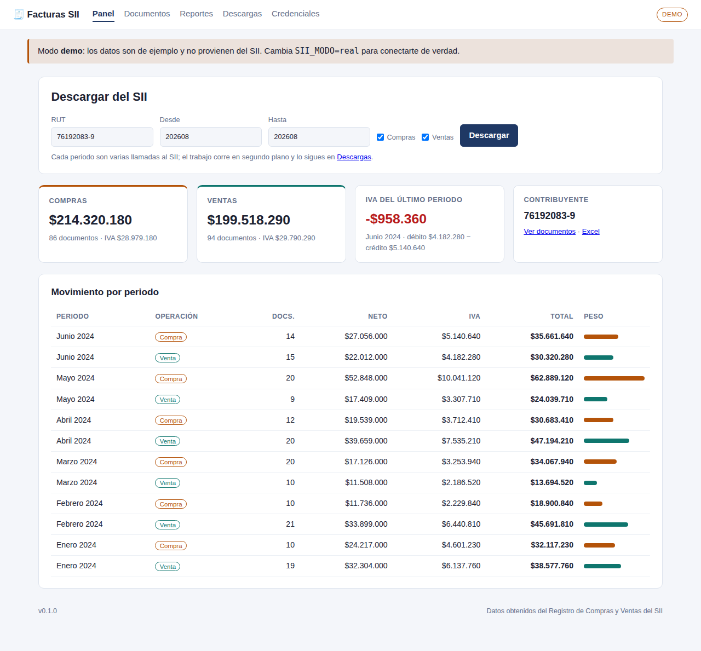
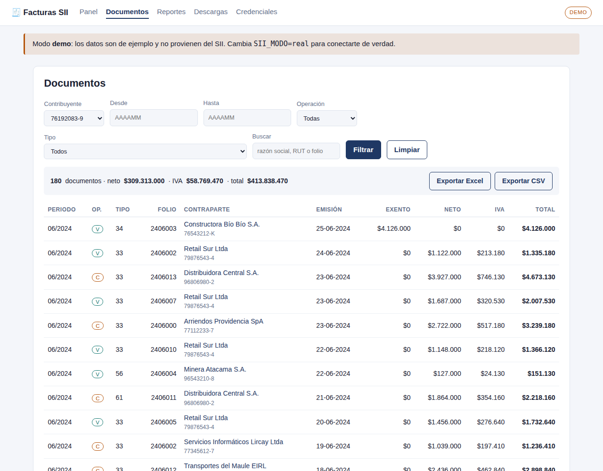

# EaSII

Asistente de trámites del SII de Chile. Descarga el **Registro de Compras y Ventas (RCV)**,
lo guarda en una base de datos local y genera reportes exportables a Excel y CSV.

Autenticación con **RUT + clave tributaria**. Backend en FastAPI, almacenamiento en SQLite.



## Qué hace

- **Descarga** compras y ventas por rango de periodos tributarios, en segundo plano.
- **Guarda** cada documento normalizado (tipo, folio, contraparte, fechas, montos, IVA y sus
  desgloses) y conserva el CSV original que entrega el SII.
- **Consulta** con filtros por periodo, operación, tipo de documento, contraparte o texto libre.
- **Trae la glosa** (detalle línea por línea: descripción, cantidad, precio) de las ventas que
  emitiste con el facturador gratuito del SII — el RCV solo trae montos, no el detalle.
- **Reporta**: totales por periodo, por tipo de documento, por contraparte, y un resumen de IVA
  débito/crédito por periodo.
- **Exporta** a Excel (un libro con cinco hojas) o CSV.
- **Automatiza** por línea de comandos, para dejarlo en un cron.

## Antes de empezar: lo que hay que saber

El SII **no publica una API** para el RCV. Esta aplicación reproduce el mismo flujo que hace el
navegador cuando entras al portal: se autentica con un navegador real (Playwright), captura las
cookies de sesión y llama a los servicios internos del RCV con esas cookies.

Consecuencias prácticas:

- **Puede romperse cuando el SII cambie su portal.** Todo lo específico del SII está aislado en
  `app/sii/endpoints.py` y `app/sii/rcv.py`, para que la reparación sea acotada.
- **El flujo del RCV no está verificado contra el SII.** Se desarrolló en un entorno sin salida a
  `*.sii.cl` (política de red del sandbox), así que el login y las llamadas al RCV están cubiertos
  por tests con respuestas de ejemplo (JSON y CSV), pero nunca se ejecutaron contra el portal de
  verdad. Antes de confiar en ella, corre `python -m app.cli doctor` (o la pestaña
  **Diagnóstico**) y descarga primero un solo periodo. El flujo de glosa de ventas (MIPYME) es la
  excepción: sí se probó a mano contra el portal real.
- **El SII limita las sesiones concurrentes por RUT.** La app cierra la sesión al terminar cada
  descarga; evita lanzar varias en paralelo para el mismo RUT.
- **Sé prudente con la frecuencia.** Hay una pausa configurable entre llamadas
  (`SII_PAUSA_ENTRE_LLAMADAS`, 0,8 s por defecto).

## Instalación

Requiere Python 3.11 o superior.

```bash
git clone <este-repo> && cd Proyectos-Claude
make instalar          # crea .venv e instala dependencias
make navegador         # descarga Chromium para Playwright
cp .env.example .env
```

Genera la clave con la que se cifran las claves tributarias en la base y ponla en el `.env`:

```bash
.venv/bin/python -m app.cli generar-clave   # → SII_CLAVE_CIFRADO=...
```

## Probarlo sin credenciales

Con `SII_MODO=demo` la aplicación no se conecta al SII: genera datos de ejemplo deterministas.
Sirve para revisar la interfaz, los reportes y las exportaciones.

```bash
make demo    # http://localhost:8000
```

## Uso real

1. Pon `SII_MODO=real` en el `.env`.
2. Levanta la app: `make servir` (Linux/Mac) o, en Windows, doble clic en `iniciar.bat`
   (abre el servidor en su propia ventana y el navegador solo).
3. Abre **Diagnóstico** y confirma que todo esté en verde (clave de cifrado, navegador,
   conexión al SII). Si algo falla, ahí mismo dice cómo resolverlo.
4. En **Credenciales**, guarda tu RUT y clave tributaria (queda cifrada con Fernet).
5. En el **Panel**, elige el rango de periodos y pulsa *Descargar* — empieza con uno solo.
6. Sigue el avance en **Descargas**; al terminar, revisa **Documentos** y **Reportes**.
7. Si necesitas la glosa de tus ventas (y las emitiste con el facturador gratuito del SII), abre
   **Documentos**, filtra por Ventas, despliega "Traer glosa de las ventas" y pide el mismo rango
   de periodos. Actualiza los documentos que ya bajaste; no crea nuevos.

Lo mismo por línea de comandos, antes de automatizar nada:

```bash
python -m app.cli doctor
```



### Línea de comandos

```bash
# Descargar compras y ventas de tres periodos
python -m app.cli sincronizar --rut 76.192.083-9 --desde 202401 --hasta 202403

# Sólo compras del periodo actual
python -m app.cli sincronizar --rut 76.192.083-9 --compra

# Ver el IVA por periodo en la terminal
python -m app.cli resumen --rut 76.192.083-9

# Exportar lo ya descargado
python -m app.cli exportar --rut 76.192.083-9 --desde 202401 --salida rcv-2024.xlsx

# Traer la glosa de ventas emitidas con el facturador gratuito del SII
python -m app.cli detalle-ventas --rut 76.192.083-9 --desde 202401 --hasta 202403
```

Para un cron diario, guarda la credencial desde la web (o define `SII_RUT` y
`SII_CLAVE_TRIBUTARIA`) y llama a `sincronizar` sin entrada interactiva.

### API JSON

| Ruta | Qué devuelve |
|---|---|
| `GET /api/salud` | Estado y modo de operación |
| `GET /api/documentos?titular=76192083-9` | Detalle paginado |
| `GET /api/reportes/periodo?titular=…` | Totales e IVA por periodo |
| `GET /api/sincronizaciones/{id}` | Estado de un trabajo de descarga |
| `GET /exportar.xlsx?titular=…` | Libro Excel con los mismos filtros que la web |

## Cómo funciona por dentro

**Autenticación** (`app/sii/portal.py`): el portal de producción usa salas de espera Queue-it y
desafíos JavaScript, así que un POST directo al formulario no basta. Se abre Chromium, se llena el
formulario en `zeusr.sii.cl`, y las cookies resultantes se pasan a un cliente `httpx`, mucho más
rápido para las decenas de llamadas siguientes.

**RCV** (`app/sii/rcv.py`): el Registro de Compras y Ventas es una SPA Angular sobre un backend
Java. Antes de consultar hay que inicializar la sesión de servidor; el paso decisivo es una llamada
JSONP a `AutTknData.cgi`, que valida la cookie `TOKEN` y es lo que hace que el backend acepte las
llamadas al `FacadeService`. Cada petición va envuelta en un sobre `{metaData, data}`.

**Estrategia de descarga**: primero el resumen del periodo (para saber qué tipos de documento
tienen datos), después el CSV oficial de *Descargar Detalles* —que trae más columnas y es la vía
más estable— y, si ese falla o viene vacío, el detalle JSON tipo por tipo.

**Normalización** (`app/sii/parsers.py`): el SII cambia nombres de columnas entre secciones y
entornos, así que los campos se buscan sobre encabezados normalizados (sin tildes ni puntuación) y
con varios alias por campo. Los montos aceptan formato chileno (`1.234.567,89`) e inglés.

**Signos**: el SII entrega los montos de las notas de crédito en positivo y los resta al calcular
los totales del periodo. Los reportes hacen lo mismo (`TIPOS_NOTA_CREDITO` en
`app/services/reports.py`).

**Clave natural**: un documento se identifica por (titular, operación, tipo, folio, RUT de la
contraparte) — sin el periodo, porque el SII puede registrar en otro mes una factura recibida con
retraso, y sigue siendo el mismo documento.

**Glosa de ventas** (`app/sii/mipe.py`): el RCV no trae el detalle línea por línea, sólo montos. Para
eso existe un portal aparte y más simple — el "Sistema de Facturación Gratuita del SII" (páginas CGI
clásicas en `www1.sii.cl`, no una SPA), donde puedes volver a ver los documentos que emitiste con esa
herramienta. Dos particularidades:

- El botón de descarga ("Archivo Respaldo") dispara un reCAPTCHA invisible antes de armar la URL, así
  que hace falta un navegador real haciendo clic, no un `GET` directo.
- El servidor rechaza cualquier búsqueda que junte más de 20 documentos con un diálogo nativo
  ("...retornan demasiados Documentos electrónicos"), en vez de truncar el resultado. La app parte el
  rango de fechas pedido a la mitad cada vez que choca con ese límite, y reintenta, hasta que cada
  tramo entra bajo el tope.

El XML de respaldo trae el nombre corto del ítem (`NmbItem`) y, si el emisor usó el cuadro de texto
largo del facturador, una descripción aparte (`DscItem`) que el Excel del mismo sistema descarta al
exportar — la app junta ambos para reconstruir la glosa completa.

Sólo sirve para **ventas** emitidas con el facturador gratuito del SII: no aplica a documentos
recibidos (el emisor te los manda directo a ti, el SII no guarda una copia consultable) ni a
documentos emitidos con un facturador privado (Nubox, Bsale, etc.), cuyo detalle vive en esa
plataforma. A diferencia del resto de `app/sii`, este flujo sí se verificó a mano contra el portal
real.

## Lo que esta versión no hace

- **No trae la glosa de documentos recibidos ni de ventas emitidas con un facturador privado.** El
  SII no ofrece ningún canal (con clave tributaria ni con certificado) para recuperar el detalle de
  una factura recibida si no la guardaste tú mismo; y el detalle de ventas emitidas con Nubox, Bsale
  u otro proveedor vive en esa plataforma, no en el SII.
- **No incluye boletas de honorarios**: viven en otro portal y tienen otro modelo de datos
  (retención en vez de IVA).
- **No emite documentos.** Es sólo de lectura.
- **El resumen de IVA es un apoyo, no una declaración.** No incluye retenciones, impuestos
  específicos, remanentes de crédito ni proporcionalidad de IVA de uso común. La propuesta oficial
  del F29 sigue siendo la del SII.
- **Sólo consulta la sección REGISTRO** por defecto. Las secciones `PENDIENTE`, `NO_INCLUIR` y
  `RECLAMADO` están definidas y soportadas por el cliente, pero aún no expuestas en la interfaz.

## Seguridad

- La clave tributaria se guarda cifrada (Fernet) con `SII_CLAVE_CIFRADO`; sin esa clave, la base no
  sirve de nada. Nunca se escribe en los logs ni se muestra en la interfaz.
- La app **no trae autenticación propia**: está pensada para correr en `localhost` o detrás de un
  proxy que ya autentique. No la expongas a Internet tal cual.
- `data/` y `.env` están en `.gitignore`.

## Estructura

```
app/
  config.py            Configuración por variables de entorno
  crypto.py            Cifrado de credenciales
  db.py  models.py     SQLite + SQLAlchemy
  rut.py               Validación y normalización de RUT
  cli.py               Línea de comandos
  sii/
    endpoints.py       URLs, endpoints y constantes del SII
    portal.py          Login con RUT + clave (Playwright)
    rcv.py             Cliente del Registro de Compras y Ventas
    parsers.py         Normalización de JSON y CSV
    demo.py            Datos de ejemplo
  services/
    sync.py            Descarga y persistencia (upsert)
    reports.py         Agregaciones
    export.py          Excel y CSV
    periodos.py        Periodos tributarios
  web/                 FastAPI, plantillas y estilos
tests/                 Suite de pruebas
```

## Desarrollo

```bash
make test    # pytest
make lint    # ruff check + format --check
```

## Créditos

El flujo de autenticación y los endpoints del RCV están portados desde
[`emisso-ai/emisso-sii`](https://github.com/emisso-ai/emisso-sii) (MIT), un SDK en TypeScript que
documentó esos servicios a partir del bundle Angular del portal.

## Aviso

Proyecto independiente, sin relación con el Servicio de Impuestos Internos. Úsalo con tus propias
credenciales y bajo tu responsabilidad, respetando los términos de uso del SII.
